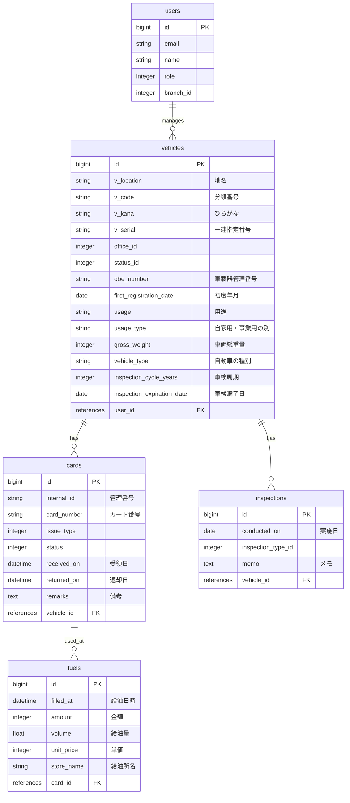
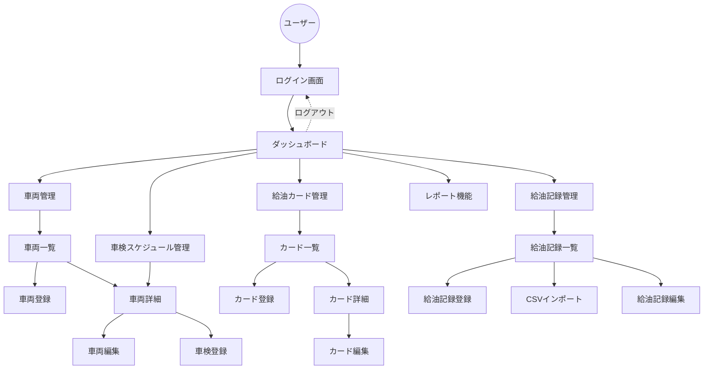

# Asset-Binder

Asset-Binderは、会社の資産(Asset)である車両の情報を一元管理し、可視化するためのWebアプリケーションです。

## 概要

日々の車両情報を登録し、現在の車両状況を把握することができます。

## 主な機能

*   **ユーザー認証機能**: Deviseを使用したユーザー登録、ログイン、ログアウト機能。外部アクセスを遮断。
*   **車両管理機能**: 車両の登録、編集、削除、絞り込み検索（所属営業所、車両番号）。
*   **期限管理機能**: 車検証の満了日を自動計算、期限前にアラート表示、車検実施日の登録、絞り込み検索（所属営業所、車両番号）。
*   **給油カード管理機能**: 給油カードの登録、編集、削除、絞り込み検索（所属営業所、管理番号、ステータス、紐づく車両番号）。車両情報との紐付け。発行、受領、返却の履歴記録。
*   **給油記録管理機能**: 給油記録の登録、CSVデータインポート、編集、削除、絞り込み検索（給油月、所属営業所、車両番号）。
*   **レポート機能**: 登録されている車両・給油カード・給油記録のデータをもとに集計、分析。
*   **ダッシュボード**: 車検期限のアラート表示や給油カードの受領処理タスクを表示。各機能の新規登録ボタン、当月給油総額、登録車両数を表示。
*   **入力補助機能**: ActiveHashを使って入力欄をプルダウン選択。
*   **レスポンシブデザイン**: Tailwind CSSを採用。

## 使用技術

*   **バックエンド**: Ruby 3.2.0, Ruby on Rails 7.1.6
*   **フロントエンド**: Hotwire (Turbo, Stimulus), Tailwind CSS, Chart.js(Chart.jsを利用したグラフは現在エラーのため非表示)
*   **データベース**:
    *   開発/テスト: MySQL
    *   本番: PostgreSQL
*   **インフラ**: Render
*   **ビルドツール**: esbuild

## ER図

## 画面遷移図

